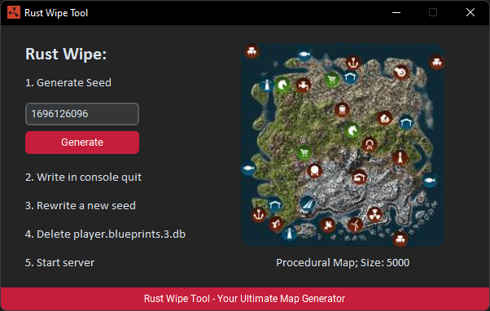

# Rust Wipe Tool
## Preview
Here's an example of an app:



## Overview
Rust Wipe Tool is a desktop application built with Python and CustomTkinter, designed to assist Rust server admins with generating new map seeds and managing server wipes. This tool fetches map data directly from `playrust.io` and provides an easy-to-use interface for generating seeds and wiping the server.

## Features
- Generate random Rust map seeds and sizes
- Display map previews using images fetched from `playrust.io`
- Responsive UI with CustomTkinter for a modern look and feel
- Easy-to-follow steps for performing server wipes

## Usage

1. Click "Generate" to get a new map seed
2. The new seed will be displayed along with the map preview image.
3. Follow the steps on the interface to wipe the Rust server.

## Installation

1. Clone the repository:
   ```bash
    git clone https://github.com/your-username/rust-wipe-tool.git

3. Navigate to the project directory:
   ```bash
   cd rust-wipe-tool
3. Install the necessary dependencies:
   ```bash
   pip install -r requirements.txt
4. Run the application:
   ```bash
   python app.py
